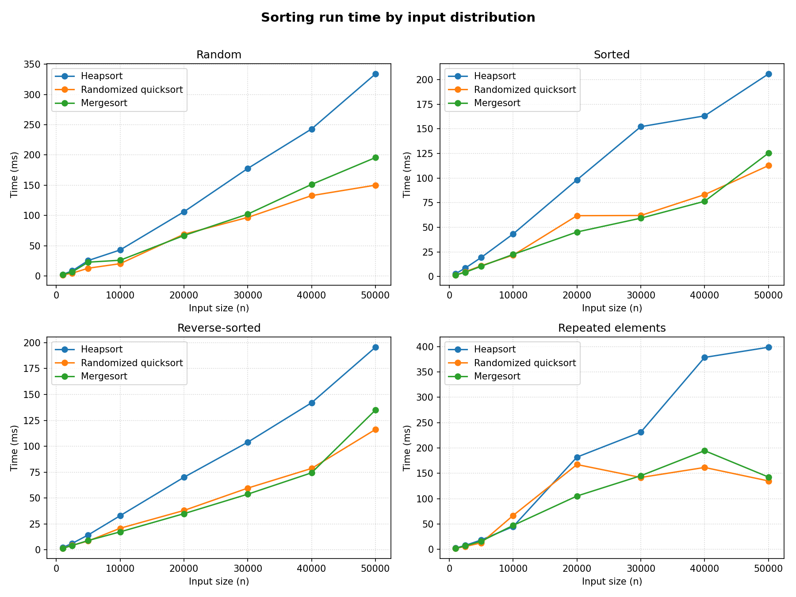

# Task 1: Analysis of Heapsort

## 1. Theoretical Analysis

### 1.1 The structure of the algorithm

Heapsort proceeds in two stages. The first stage rearranges the input array into a max-heap, so the largest element is always the root. The second stage repeatedly swaps the root with the last element of the unsorted region, shrinks the heap by one, and bubbles the new root down until the heap property is restored. Because the root always holds the largest remaining value, each swap moves that maximum out of the heap and into the last open slot of the array. These final positions are filled from the back toward the front, so the largest value settles at the end and the smallest at the start, which leaves the whole array sorted in increasing order after *n - 1* iterations (Cormen et al., 2022). The cost of the algorithm is governed by two primitives, the bottom-up build and the repeated bubble-down, whose costs are analyzed below.

### 1.2 Why every case is O(n log n)

Since a heap of *n* elements stored in an array is a nearly complete binary tree, its height is always the floor of *log n*, regardless of how the values are arranged (Cormen et al., 2022). A bubble-down, which the implementation performs in max_heapify, walks a single path from a node toward a leaf, exchanging the node with its larger child until it settles, so its cost is bounded by the height of the tree and is therefore *O(log n)* (AlgoMaster, 2026). The build stage might appear to cost *O(n log n)*, since it calls max_heapify once for every internal node. A tighter accounting shows it is actually *O(n)*. The nodes near the leaves, which are the most numerous, sit at small heights and can bubble down only a short distance. While the few nodes near the root that can bubble the full height are rare. Summing the work height by height yields a series that converges to a constant multiple of *n*, so building the heap is linear (Cormen et al., 2022). The second stage dominates the running time. It runs *n - 1* iterations, and each iteration performs one constant-time swap followed by a bubble-down over the shrinking heap, at a cost of *O(log n)*. The product of a linear number of iterations and a logarithmic cost per iteration gives *O(n log n)* for the second stage, and adding the linear build leaves the total at *O(n log n)*.

This same reasoning fixes the running time across the worst, average, and best cases at *O(n log n)*. The height of the heap does not depend on the input order, so each extraction faces a bubble-down bounded by the same logarithmic height whether the data arrived random, sorted, or reverse sorted. The best case is not gradually faster because the element promoted to the root after each swap is a former leaf, which tends to be small and must travel most of the way back down the tree, so the per-iteration cost stays logarithmic rather than collapsing to a constant (AlgoMaster, 2026). The only inputs that escape this pattern are arrays of identical values, where no bubble-down ever moves an element, but these are special rather than representative cases. Heapsort therefore offers a guaranteed *O(n log n)* bound on every input, which is its main theoretical advantage over a deterministic quicksort whose worst case is quadratic.

### 1.3 Space complexity

Heapsort sorts inside the input array and allocates no auxiliary array that scales with *n*, so its auxiliary space is *O(1)* (AlgoMaster, 2026). The heap is a view over the same array the caller supplied, and the sort rearranges elements by swapping in place. The recursive form of max_heapify used here adds a chain of stack frames whose depth equals the height of the tree, which is *O(log n)*, and an iterative rewrite of the same bubble-down would remove even that overhead. This in-place footprint distinguishes heapsort from mergesort, which allocates *O(n)* auxiliary buffers and returns a new list, and contrasts with randomized quicksort, whose recursion uses *O(log n)* expected stack space.

## 2. Empirical Comparison

The benchmark compares heapsort against randomized quicksort and mergesort over input sizes from 1000 to 50000, across random, sorted, reverse-sorted, and repeated-element distributions, with each figure the average of three trials. Times are reported in milliseconds. The plot performance_metrics.png shows the same measurements visually for the random distribution.

### Random input

| Input size n | Heapsort (ms) | Randomized quicksort (ms) | Mergesort (ms) |
|:------:|:--------------:|:--------------------------:|:---------------:|
| 1000 | 2.145 | 1.279 | 1.453 |
| 2500 | 5.023 | 3.663 | 4.898 |
| 5000 | 13.068 | 6.627 | 14.597 |
| 10000 | 28.589 | 16.480 | 19.930 |
| 20000 | 66.977 | 41.767 | 42.967 |
| 30000 | 118.263 | 54.810 | 83.162 |
| 40000 | 169.680 | 83.832 | 106.121 |
| 50000 | 307.362 | 150.567 | 160.865 |

### Heapsort across the four distributions

| Input size n | Random (ms) | Sorted (ms) | Reverse-sorted (ms) | Repeated (ms) |
|:------:|:------------:|:------------:|:--------------------:|:--------------:|
| 1000 | 2.145 | 1.828 | 1.436 | 2.024 |
| 10000 | 28.589 | 27.731 | 24.812 | 27.033 |
| 50000 | 307.362 | 166.241 | 164.377 | 196.518 |

## 3. Discussion

### 3.1 Where the results match the theory

All three curves grow slightly faster than linearly as n increases, which is the expected signature of an *O(n log n)* running time, since doubling n multiplies the time by a little more than two (Cormen et al., 2022). The ordering of the three algorithms is stable across every size and distribution, with randomized quicksort the fastest, mergesort in the middle, and heapsort the slowest. Because all three share the same asymptotic class, this ordering reflects differences in the constant factor rather than in the growth rate.

Heapsort carries the largest constant factor, and the likely cause is poor cache locality. A bubble-down repeatedly compares a node at index *i* with its children at indices *2i + 1* and *2i + 2*, so as the heap grows the algorithm jumps between array positions that lie far apart in memory, which defeats the processor cache. Mergesort and quicksort, by contrast, mostly touch contiguous regions of the array, so they make better use of the cache even though they do the same order of comparisons. This explains why heapsort can be the slowest of the three in wall-clock time while still being asymptotically optimal and the most economical in memory (AlgoMaster, 2026).

### 3.2 Behavior across distributions

The clearest empirical confirmation of the theory is the flatness of heapsort and mergesort across the four distributions. At each fixed size the heapsort times for random, sorted, reverse-sorted, and repeated inputs agree closely, which matches the analysis that the height of the heap, and therefore the cost of every bubble-down, is independent of the input order (Cormen et al., 2022). Mergesort behaves the same way, because it always divides the array in half regardless of the values it holds. The mild variation that remains is measurement noise together with second-order cache effects rather than a change in asymptotic behavior.

Randomized quicksort, on the other hand, is the algorithm whose cost could in principle depend on the input, because a poorly chosen pivot produces unbalanced splits. The random pivot is precisely what prevents this. By selecting the pivot uniformly at random, the algorithm avoids the degenerate splits that a fixed pivot would hit on sorted or reverse-sorted data, so it stays fast and balanced across all four distributions (Cormen et al., 2022). A deterministic quicksort that always selected the first element would instead reach its quadratic worst case on sorted and reverse-sorted input, which is why that variant was excluded from this benchmark so the comparison could scale to large *n*. Its quadratic degradation on ordered input was demonstrated separately and can be taken as established.

## References

AlgoMaster. (2026). *Heap sort*. https://algomaster.io/learn/dsa/heap-sort

Cormen, T. H., Leiserson, C. E., Rivest, R. L., & Stein, C. (2022). *Introduction to Algorithms* (4th ed.). Random House Publishing Services.
