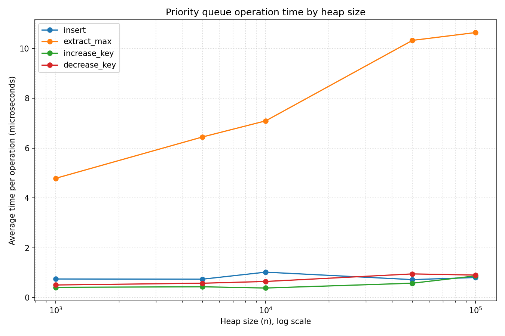

# Task 2: Analysis of a Max-Heap Priority Queue

## 1. Design justification

The scheduler stores tasks in a max-heap keyed on priority, so the highest-priority task always sits at the root and can be served in one step. A max-heap is the natural structure for this access pattern, because it keeps the maximum immediately available while only partially ordering the remaining elements, which is far cheaper than the full ordering a sorted list would maintain (Cormen et al., 2022). The queue is a nearly complete binary tree laid out in a 0-indexed array, where the children of the node at index *i* live at indices *2i + 1* and *2i + 2*, so the parent and child relationships are arithmetic rather than pointer-based.

Ties in priority are broken by arrival time, with the earlier arrival ranked above the later one. This rule is expressed in a single comparison on the Task object, which compares priorities first and falls back to arrival time only when the priorities are equal. The tie-break gives the scheduler a predictable and fair behavior, since tasks of equal importance leave the queue in the order they entered it, which matches the FIFO behavior of a regular queue and prevents a later task from overtaking an equally urgent earlier one.

The third design choice is a position map, a dictionary from task identifier to the current heap index of that task. Without it, raising or lowering the priority of a known task would require a linear scan to find the task before heapifying it, which would make reindexing cost *O(n)*. The map locates any task in constant time, so increase_key and decrease_key spend their time only on the logarithmic bubble that follows. The map is kept correct in exactly one place, the swap routine, which is the only operation that changes a task index, so every exchange updates the recorded positions of the two tasks involved. Concentrating the bookkeeping in the swap keeps the map consistent without scattering index updates across the code (Sylhar, 2025).

## 2. Operation complexity

Let *n* be the number of tasks in the queue. The height of the heap is the floor of *log n*, because the tree is nearly complete, and this height bounds the length of any bubble path (Cormen et al., 2022). The insert operation appends the new task at the end of the array and then bubbles it up, comparing it with its parent and exchanging upward until it reaches a position where it no longer outranks its parent. The bubble-up walks at most one path from a leaf to the root, so insert costs *O(log n)*. The extract_max operation removes the root, moves the last task into the root position, and bubbles it down through the larger of its children until the heap property is restored. The bubble-down traverses at most the full height of the tree, so extract_max also costs *O(log n)*.

The increase_key operation locates the task through the position map in constant time, raises its priority, and bubbles it up, because a higher priority can only move a task closer to the root. The decrease_key operation is the mirror image: it locates the task, lowers its priority, and bubbles it down, because a lower priority can only move a task toward the leaves. Each performs a constant-time lookup followed by a single bubble along one path, so both run in *O(log n)* (Sylhar, 2025). The is_empty operation only tests whether the underlying array holds any element, which is a constant-time check independent of *n*, so it runs in *O(1)*.

## 3. Empirical scaling

The benchmark times each of the four operations over heap sizes from 1000 to 100000, averaging roughly one thousand operations per measurement. Times are reported in microseconds. The plot operation_scaling.png displays the same measurements.

| Heap size n | insert (us) | extract_max (us) | increase_key (us) | decrease_key (us) |
|------:|------------:|-----------------:|------------------:|------------------:|
| 1000 | 0.790 | 5.737 | 0.370 | 0.630 |
| 5000 | 0.818 | 6.238 | 0.503 | 0.683 |
| 10000 | 1.489 | 6.808 | 0.455 | 0.587 |
| 50000 | 0.824 | 12.541 | 0.796 | 0.856 |
| 100000 | 1.070 | 10.932 | 1.014 | 0.831 |

Every operation rises only slowly as *n* grows by a factor of one hundred, which is the signature of a logarithmic cost, since a logarithm increases by a small additive amount when its argument is multiplied. The extract_max operation shows the clearest logarithmic climb, roughly doubling across the range, because it always promotes a former leaf to the root and then bubbles it down through close to the full height of the heap, so it exercises the longest bubble path of the four operations. The other three operations look almost flat and somewhat noisy. Their cost is genuinely *O(log n)*, but their average bubble path is short. A fresh insert often bubbles up only a few levels before settling, and a re-index that changes a priority by a modest amount inside a wide range of priorities usually moves the task only a short distance. The logarithmic growth is real, yet at sub-microsecond scales it is small in absolute terms and is partly hidden by timing noise, so the curves appear nearly level. The measured behavior therefore agrees with the theory once the difference between the long bubble of extract_max and the typically short bubble of the other operations is taken into account.

The evidence evaluated for each individual operation is supported independently by the heapsort scaling in Task 1. Because heapsort executes *n* extraction operations and completes in an overall time of *O(n log n)*, this performance is consistent only if the cost of each extraction remains *O(log n)*. Both experiments observe the identical logarithmic bubble cost through separate analytical approaches, which involve timing the isolated operation and aggregating the cost across a complete sort to confirm their mutual agreement.

## 4. Scheduling demonstration

The demonstration inserts five tasks, two of which share priority five, then applies one increase_key and one decrease_key mid-stream before serving every task with repeated extract_max. Task 2 (T2), in the tasks list, is raised from priority three to six, and task 5 is lowered from priority four to two. The resulting execution order is [2, 1, 3, 5, 4].

This order confirms the design. T2, raised to the highest priority of six, is served first, which shows that increase_key correctly floated it to the root. T1 and T3 both hold priority five, and T1, which arrived earlier, is served before T3, so the arrival-time tie-break is visible in the output. T5, lowered to priority two, falls behind every higher-priority task and is served second to last, ahead only of T4 at priority one, which shows that decrease_key correctly sank it. A check after the re-keying confirmed that every task remained present and reported its updated priority, so the position map stayed consistent through the mid-stream changes.

The primary performance advantage is that the scheduler can adapt to changing conditions efficiently. Adjusting the priority of an existing task in the queue requires a time complexity of only *O(log n)*, which is equivalent to the cost of a new insertion. Because the queue facilitates dynamic priority adjustments without necessitating a complete rebuild, this efficiency directly supports system requirements when the significance of pending work shifts over time.

## References

Cormen, T. H., Leiserson, C. E., Rivest, R. L., & Stein, C. (2022). *Introduction to Algorithms* (4th ed.). Random House Publishing Services.

Sylhar. (2025, June 27). *Data structure: Priority queue*. https://sylhare.github.io/2025/06/27/Memo-priority-queue.html
