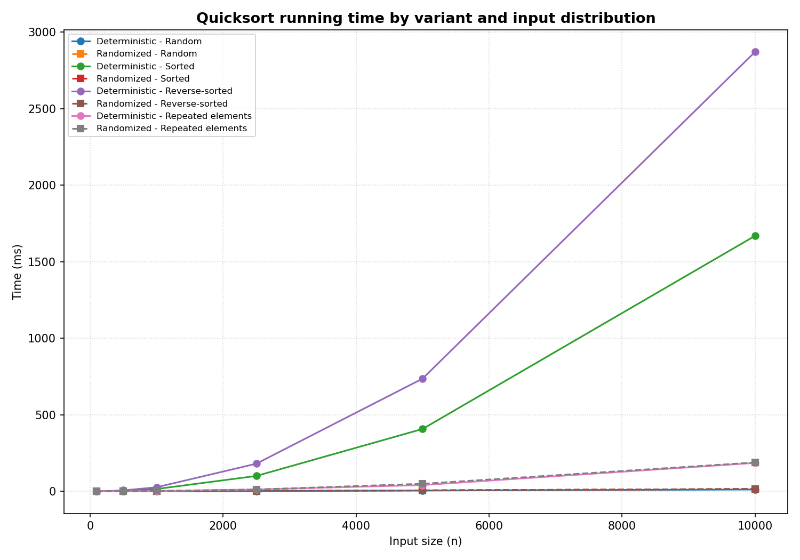

# Quicksort: Implementation, Analysis, and the Effect of Randomization

## 1. Implementation

Two versions of Quicksort were implemented in Python and were kept identical in every respect except one, so that any observed difference in behavior could be attributed to a single cause. Both sort the array in place using the same Lomuto partition procedure and differ only in how the pivot is selected. The deterministic version always uses the first element of the subarray as the pivot, whereas the randomized version selects an index uniformly at random and exchanges that element into the pivot position before performing the identical partition (Cormen et al., 2022).

The partition procedure first moves the chosen pivot to the high end of the current subarray. It then advances a boundary index from left to right, swapping every element smaller than the pivot into the region below that boundary. Once the scan is complete, the pivot is placed into the boundary position, which is its final sorted location, and the index of that position is returned so that the caller can recursively sort the elements lying below and above it. Elements equal to the pivot are never swapped and therefore collect on the upper side of the division, a property that becomes relevant when the input contains many repeated keys, as discussed in Section 5. Because every other component is shared, the method of choosing the pivot is the only independent variable in the experiment.

Each sorting routine also returns the maximum recursion depth reached during execution. This single value provides a direct measurement of memory consumption rather than an indirect estimate. Because the algorithm sorts in place and allocates no second array, the depth of the recursion equals the height of the call stack, which is where the memory used by the procedure actually accumulates. Reporting the depth therefore converts the space cost into an observable quantity that can be tabulated beside the running time.

## 2. Theoretical Analysis

### 2.1 The running time equals the total size of all partitioned subarrays

A single partition of a subarray containing *m* elements performs approximately *m* comparisons, so its cost is proportional to *m*:

```
cost of one partition = c * m
```

Here *m* is the number of elements in the subarray being partitioned, and *c* is a constant representing the work performed for each element, which includes a comparison, a possible swap, and the overhead of the loop. Summing this cost across every partition call yields the total running time, so the running time equals *c* multiplied by the sum of the sizes of all subarrays that are ever partitioned. Determining the speed of the algorithm therefore reduces to a question of geometry, namely how large the subarrays are at each level of the recursion and how many levels exist in total. The three classical cases follow from three different answers to that geometric question (Cormen et al., 2022).

The best case, of order *n log n*. In the most favorable situation every pivot falls at the median of its subarray, so each partition divides the data into two equal halves. The running time then satisfies the following recurrence:

```
T(n) = 2 * T(n / 2) + c * n
```

In this expression *T(n)* denotes the time required to sort *n* elements, the two terms *T(n / 2)* represent the two subproblems of half the size, and *c* times *n* is the linear cost of partitioning at the current level. The resulting recursion tree has a height of *log n*, and the subarray sizes at each level sum to *n*, so the total work is *c* times *n* repeated *log n* times. The running time in this case is therefore of order *n log n*. Splits that maintain a constant proportion, for example a division of one tenth against nine tenths, alter the height of the tree by only a constant factor and so preserve the same order of growth (Gautam, 2023).

The worst case, of order *n* squared. The opposite situation arises when every pivot is the smallest or the largest element of its subarray. One side of the division is then empty while the other retains all of the remaining elements, and the recurrence collapses to a simpler form:

```
T(n) = T(n - 1) + c * n
```

Here the single term *T(n - 1)* is the only nonempty subproblem, and *c* times *n* is again the cost of partitioning. Expanding the recurrence produces a sum of costs that decrease linearly, namely *c* times the quantity *n* plus *(n - 1)* and so on down to 1, which equals *c* times *n* times the quantity *(n + 1)*, divided by 2. The running time in this case is therefore of order *n* squared. The deterministic rule that selects the first element reaches precisely this situation when the input is arranged in ascending or descending order, because the first element of an already ordered subarray is exactly its minimum or its maximum at every level of the recursion (Soni, 2025).

The average case, of order *n log n*. The randomized version attains an expected running time of order *n log n* on every input:

```
E[T(n)] = O(n log n)
```

In this expression *E* denotes the expected value, so *E[T(n)]* is the average running time taken over the random choices of the pivots rather than over any assumed distribution of the inputs. Because the pivot is selected at random, the partition is expected to place some constant fraction of the elements on each side of the division at every level of the recursion. A division of this kind reproduces the balanced behavior established for the best case, in which the height of the recursion tree is of order *log n* and the work performed at each level is of order *n*. The bound is robust, because even when a few levels exhibit the most unbalanced split possible, the cost of those levels is absorbed by the balanced levels that surround them, so the order of growth is unchanged. Combined with the best case bound of the same order, this reasoning yields an expected running time of order *n log n* (Cormen et al., 2022).

### 2.2 Space Complexity

Quicksort operates in place, so it does not allocate a second array, and its partition uses only a constant number of index and temporary variables irrespective of the size of the subarray:

```
auxiliary space per partition = O(1)
```

The dominant space cost arises from the recursion stack, whose size equals the maximum depth of the recursion. That depth obeys the same geometry as the running time. In both the balanced and the expected cases the height of the tree is of order *log n*, so the stack likewise occupies space of order *log n*. In the deterministic worst case the tree forms a single chain of length *n*, so the stack occupies space of order *n*:

```
stack space = O(log n) expected,  O(n) worst case
```

This is precisely the quantity that the implementation records, and Section 4 demonstrates that the measured depths follow these two predictions very closely. When *n* equals 10,000, the depth remains near 30 for the cases that grow logarithmically, and it equals *n* exactly in the deterministic worst case. The contrast between these two outcomes is the practical content of the difference between logarithmic and linear space.

## 3. Randomization and the Likelihood of the Worst Case

Randomization alters more than the average performance, because it changes what controls the running time. In the deterministic version certain inputs, such as sorted or repetitive inputs, can force the worst case on every execution. In the randomized version no fixed input can achieve this, because the choice of pivot no longer depends on the arrangement of the data but on an internal random source. The worst case continues to exist as a mathematical possibility, yet it now requires an unfortunate sequence of random selections rather than a particular property of the input, so the expected running time is of order *n log n* for every input. This is the precise sense in which judicious randomization provides good expected performance over all inputs (Cormen et al., 2022).

Because the expected bound holds independently of the arrangement of the data, it functions as a practical guarantee rather than an average taken over some assumed distribution of inputs. The deterministic version achieves a low running time only on inputs that happen to be well arranged, whereas the randomized version achieves the same expected running time on every input, including the ascending and descending arrangements that defeat the deterministic rule (Cormen et al., 2022). The measurements confirm this property, since the recursion depth of the randomized version never departs far from 30 across random, ascending, and descending inputs, which is exactly the behavior that a stable expected bound predicts.

## 4. Empirical Comparison

The two versions were timed using Python 3.13 on the macOS operating system. Every reported time is the duration measured by the wall clock in milliseconds, averaged over three trials, and every table also lists the maximum recursion depth, which serves as the measured space cost. The input sizes ranged from 100 to 10,000, and four distributions were examined. The final column of each table reports the ratio of the deterministic time to the randomized time, so a value of 2.0 indicates that the deterministic version required twice as long on the same input. The trend in this ratio across the sizes, rather than any individual row, is the quantity of primary interest, because constant factors and measurement noise affect single rows but cancel in the overall pattern. The results appear in Tables 1 through 4, each devoted to a single distribution, and in Figure 1, which presents the running times in graphical form.

**Table 1**: *Running Time and Maximum Recursion Depth on Randomly Ordered Input*

| *n* | Deterministic (ms) | Randomized (ms) | Det. depth | Rand. depth | Ratio (det / rand) |
|------:|-------------------:|----------------:|-----------:|------------:|-------------------:|
| 100 | 0.044 | 0.066 | 12 | 14 | 0.67 |
| 500 | 0.430 | 0.509 | 19 | 19 | 0.84 |
| 1,000 | 0.885 | 1.093 | 22 | 21 | 0.81 |
| 2,500 | 2.651 | 3.151 | 28 | 27 | 0.84 |
| 5,000 | 5.408 | 6.890 | 28 | 27 | 0.78 |
| 10,000 | 12.628 | 14.685 | 30 | 30 | 0.86 |

As Table 1 shows, on data presented in random order both versions run in time of order *n log n* and remain within a small constant factor of each other. The ratio stays below one because a first element drawn from already random data behaves like a random pivot, while the randomized version pays a small additional cost to generate a random index at every call. The two recursion depths remain close to *log n* and reach only 30 when *n* equals 10,000, which confirms that neither version approaches its worst case on this distribution.

**Table 2**: *Running Time and Maximum Recursion Depth on Sorted Input*

| *n* | Deterministic (ms) | Randomized (ms) | Det. depth | Rand. depth | Ratio (det / rand) |
|------:|-------------------:|----------------:|-----------:|------------:|-------------------:|
| 100 | 0.128 | 0.065 | 100 | 13 | 1.97 |
| 500 | 3.939 | 0.438 | 500 | 18 | 8.99 |
| 1,000 | 15.968 | 1.103 | 1,000 | 22 | 14.48 |
| 2,500 | 103.691 | 3.059 | 2,500 | 27 | 33.90 |
| 5,000 | 408.360 | 7.170 | 5,000 | 28 | 56.95 |
| 10,000 | 1,690.684 | 14.468 | 10,000 | 30 | 116.86 |

**Table 3**: *Running Time and Maximum Recursion Depth on Reverse Sorted Input*

| *n* | Deterministic (ms) | Randomized (ms) | Det. depth | Rand. depth | Ratio (det / rand) |
|------:|-------------------:|----------------:|-----------:|------------:|-------------------:|
| 100 | 0.201 | 0.068 | 100 | 15 | 2.96 |
| 500 | 5.632 | 0.441 | 500 | 19 | 12.77 |
| 1,000 | 26.509 | 1.069 | 1,000 | 21 | 24.80 |
| 2,500 | 191.319 | 3.773 | 2,500 | 25 | 50.71 |
| 5,000 | 807.005 | 7.500 | 5,000 | 28 | 107.60 |
| 10,000 | 3,210.626 | 18.083 | 10,000 | 33 | 177.55 |

As Tables 2 and 3 show, inputs arranged in ascending order and inputs arranged in descending order drive the deterministic version into the worst case derived in Section 2.1, and the measurements display that behavior without ambiguity. Each doubling of *n* approximately quadruples the deterministic time, which moves from 103 ms to 408 ms and then to 1,691 ms across the final three ascending sizes, and this fourfold growth per doubling is the characteristic signature of quadratic time, while the randomized time over the same interval merely doubles. Because a quadratic quantity is being divided by a quantity of order *n log n*, the ratio increases almost linearly with *n*, rising from about 9 to about 117 on ascending input and from about 13 to about 178 on descending input. The recursion depth conveys the same conclusion in terms of space rather than time. The deterministic depth equals *n* at every size, which confirms that the call stack grows in direct proportion to the input, whereas the randomized depth never rises above the low 30s. The contrast between a stack of 10,000 frames and a stack of about 30 frames is the practical meaning of the difference between linear and logarithmic space, and it is the reason the deterministic version requires the recursion limit of the interpreter to be raised before the largest sorted inputs can be processed at all.

**Table 4**: *Running Time and Maximum Recursion Depth on Repeated Elements Input*

| *n* | Deterministic (ms) | Randomized (ms) | Det. depth | Rand. depth | Ratio (det / rand) |
|------:|-------------------:|----------------:|-----------:|------------:|-------------------:|
| 100 | 0.060 | 0.094 | 20 | 20 | 0.64 |
| 500 | 0.617 | 0.790 | 68 | 65 | 0.78 |
| 1,000 | 2.087 | 2.653 | 116 | 121 | 0.79 |
| 2,500 | 12.091 | 13.662 | 282 | 282 | 0.89 |
| 5,000 | 42.616 | 45.322 | 544 | 543 | 0.94 |
| 10,000 | 166.852 | 182.981 | 1,046 | 1,043 | 0.91 |

As Table 4 shows, drawing every value from a pool of only 10 distinct keys slows both versions to a similar degree, and the ratio remains close to one, which indicates that randomization provides no benefit in this situation. The depths confirm a shared and partial degradation, since both climb to approximately 1,000 when *n* equals 10,000, a figure that lies well above the logarithmic depth of 30 observed for random input yet well below the linear depth of 10,000 observed in the sorted worst case. The cause is structural rather than a matter of fortunate or unfortunate pivots, and it is examined in Section 5.

**Figure 1**: *Running Time Versus Input Size*



Figure 1 presents the running times, where the contrast between the two growth rates is immediate. The deterministic curves for ascending and descending input rise steeply toward 1,700 ms and 3,200 ms, while every curve of order *n log n* remains pressed flat against the horizontal axis. The steep upward bend of the two worst case curves is the visible form of quadratic growth, since a quadratic quantity climbs faster and faster as *n* increases, whereas a quantity of order *n log n* climbs almost in proportion to *n* and so appears nearly flat at this scale. The fact that the faster curves look almost flat is itself informative, because a duration of 180 ms is genuinely negligible beside a duration of 3,200 ms. The figure therefore conveys both the existence of the worst case and the magnitude of the penalty that it imposes.

## 5. Discussion

The measurements agree with the theory as expected. The deterministic worst case appears precisely on ascending and descending input, where it shows quadratic growth in time and linear growth in depth. The randomized version, by contrast, is indifferent to input order, since its times on random, ascending, and descending inputs of the same size agree to within ordinary measurement noise. This indifference is the direct empirical form of the expected bound holding for any arrangement of the data, and it is the central practical advantage of randomization over the deterministic rule.

The few results that deviate from  this pattern can be attributed to an ordinary cause that does not affect the conclusion. On random input the deterministic version is marginally faster, because it avoids the small cost of generating a random index. At the smallest sizes the ratio is irregular, because timer resolution and memory allocation dominate durations below one millisecond. Neither effect contradicts the theory, and both are reasons to read the trend across sizes rather than any single row.

The repeated-elements case is the one situation in which randomization offers no remedy, because the slowdown comes from the two-way partition rather than from pivot choice. When many keys equal the pivot, they are sent to the same side and cannot be subdivided, so both versions degrade together. The standard fix is a three-way partition that separates keys smaller than, equal to, and larger than the pivot, an arrangement that sorts a run of identical keys in linear time and is independent of the pivot rule (Gautam, 2023). A deterministic median-of-three pivot likewise removes the failure on sorted input at negligible cost, although, remaining deterministic, it does not provide the input-independent expected guarantee that randomization offers (Gautam, 2023; Cormen et al., 2022).

## References

Cormen, T. H., Leiserson, C. E., Rivest, R. L., & Stein, C. (2022). *Introduction to algorithms* (4th ed.). Random House Publishing Services. https://reader2.yuzu.com/books/9780262367509

Gautam, S. (2023). *Quick sort algorithm*. EnjoyAlgorithms. https://www.enjoyalgorithms.com/blog/quick-sort-algorithm

Soni, N. (2025). *Quick sort*. DEV Community. https://dev.to/nitinsonicoder/quick-sort-55ng
