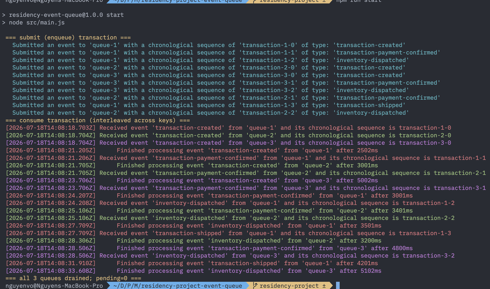

# Proof of Concept Implementation of a Distributed Event Queue

*Formatting target: APA 7, 12-point font, double-spaced. Headings follow APA levels.*

## Core Data Structures and Operations

The implementation realizes the design as working code, and each component keeps the time complexity that the design promised. The work divides across five units. At the center is the Queue, a singly linked list with head and tail pointers that exposes only enqueue, dequeue, peek, isEmpty, size, and clear, whose responsibility is to hold reference and the order of the events. Each of these methods touches only one end of the list, so it runs in constant time and avoids the linear cost that removing the front element of a dynamic array would incur. Responsibility for dispatch belongs to the EventQueueManager, which holds the hash map from key to Queue together with the shared pending counter and extends the Node.js EventEmitter, making the manager itself the stream that consumers listen on. An Event carries its key, identifier, payload, and arrival sequence and exposes a single acknowledge method, and because it references no queue, acknowledgment travels through the consumer that adopted it rather than through the data structure. The Producer submits events and signals when the final one has arrived, while the Consumer subscribes to the manager, adopts each dispatched head, waits for the simulated work, and then acknowledges.

The key operations map onto the classic structure operations of insertion, search, peek, and deletion, and each runs in constant time on average. Insertion is enqueue, which appends an event to the tail of its queue after the manager looks up or creates that queue in the map. Search is the map lookup by key, which selects the correct queue without scanning the others, reflecting the routing model in which tuples that share a key are directed to the single instance responsible for that key (Liu et al., 2024). Peek drives dispatch, where the manager emits an event only when it is the current head of its queue, so exactly one event per key is ever in flight. Deletion is the acknowledgment path, where the manager dequeues the confirmed head, decrements the counter, and dispatches the next head, a discipline that mirrors the sequential queue described by Nowacki et al. (2021), which advances to the next message only after the previous one is confirmed. Because the map lookup, the head peek, and the head dequeue never depend on the number of keys or the number of buffered events, dispatch latency stays stable as the workload grows, and the whole normal path is constant time.

## Demonstrating Ordering and Concurrency

The components described so far come together in a runnable demonstration that exercises the ordering and concurrency the design promises. The program submits a series of events drawn from three independent business transactions, keyed as queue-1, queue-2, and queue-3, so that each transaction maps to its own queue and its events stay in first in, first out (FIFO) order while the three transactions proceed concurrently. Each transaction moves through the same lifecycle of created, then payment confirmed, then inventory dispatched, with queue-1 also reaching shipped. Figure 1 captures one run, and the queues are color coded to keep the interleaving legible, with queue-1 in red, queue-2 in green, and queue-3 in magenta. Chronological order is the sequence in which events that share a key must proceed, because the business process dictates that a transaction's events follow the lifecycle order described above, which the log records as each event's chronological sequence. Between transactions with separate keys there is no such order, since events of independent transactions carry no ordering relationship and a real producer may submit events for two different keys at the same instant, so the sequence of the submission loop reflects only the order in which events happen to reach the manager. Processing order is the completion sequence, the order in which consumers finish their simulated work. A naive engine that replayed the whole stream through one shared queue would collapse these independent timelines into a single sequence, finishing every event in the order it was submitted.



*Figure 1. Terminal output of one demonstration run. Submission lines appear first, then the interleaved consume lines, colored by queue (queue-1 red, queue-2 green, queue-3 magenta), ending with clean termination.*

The chronological sequence of events with the same ordering key is preserved exactly. The queue-1 events complete as transaction-1-0, then 1-1, then 1-2, then 1-3, never out of order, because acknowledgment gates each successor. Across keys the processing order diverges from submission. The first created event on queue-1 finishes after roughly 2502 ms, the queue-2 created event after about 3001 ms, and the queue-3 created event after about 5002 ms, so the three transactions complete on separate timelines even though they were submitted in an interleaved burst. This interleaving is possible because Node.js runs a single event loop rather than several processors. When the producer submits, the three created events for the three distinct keys are dispatched together and are received at nearly the same instant, as the three simultaneous created lines at the top of the consume section show. Each consumer then yields at its await on the simulated work, which returns control to the event loop so it can service the other queues, and the result is concurrency rather than true parallelism.

The run also demonstrates backpressure and clean termination. Because the manager emits only the current head of a queue, the next event on a key is received only after its predecessor has finished and been acknowledged. In the log, each payment confirmed line appears immediately after the finished processing line for the created event on the same key. This matches producer speed to consumer speed within each key, the queue based rate matching that follows from the definition of backpressure as the condition in which a pipeline produces data faster than downstream operators can consume it (Hanif et al., 2020). The gate never stalls a healthy queue, yet it never lets two events on the same key run at once. When the last event on every key has been acknowledged and the producer has signaled that it is done, the manager reports that all three queues are drained with a pending count of zero, the final banner line in Figure 1, which confirms that no event was lost and that the ordering guarantee held across the whole run.

## Code Quality and Best Practices

The implementation follows conventions that keep it readable and testable. Modularity is enforced by placing one class in each file, so that Event, Queue, EventQueueManager, Producer, and Consumer are separate modules, with shared helpers for the promise based sleep and the structured logger kept in a support directory. Every public class and method is documented with a JSDoc block that records its parameters, its return value, and its role. The separation of roles is deliberate, because the Queue is a pure data structure, the manager is the only component that dispatches, and the producer and consumer never share ownership of an event, which keeps each unit small enough to reason about and test in isolation.

Error handling is explicit at the boundaries where invalid state would otherwise propagate. The Event constructor rejects a missing key, a missing identifier, or a negative or non-numeric payload, so a malformed event cannot enter a queue. The acknowledge method guards against a double acknowledgment and against acknowledgment before dispatch, which keeps the pending counter honest and gives the idempotent behavior that reliable consumers require (Ratra et al., 2025). A failed consume is contained rather than silently discarded. The handler logs the failure and leaves the event unacknowledged at its queue head, so the queue stalls in place instead of advancing past unfinished work, which preserves the ordering guarantee even under error. These choices are validated by a suite of tests run with the built in node test runner. The suite covers structure level behavior such as FIFO order and empty queue handling, manager level behavior such as backpressure, cross-key dispatch, and the termination guard, and end to end ordering under mixed workloads. Determinism is achieved by injecting the clock and the logger into the consumer, so tests observe consume completion order without depending on wall clock timing, a practice that makes the concurrency behavior reproducible.

## Implementation Process and Next Steps

Building the prototype as a single coherent design surfaced three problems whose solutions define its behavior. The first was re-entrancy. Because acknowledgment triggers the dispatch of the next head, a synchronous emit could re-enter the manager in the middle of an enqueue or a removal and corrupt the counter. The manager defers every dispatch with process.nextTick, so the current operation finishes before the next event is emitted:

```js
dispense(event) {
  if (!event) return;
  const queue = this.queues.get(event.key);
  if (!queue) return;
  if (queue.peek() === event) {
    process.nextTick(() => this.emit('event', event));
  }
}
```

The second problem was expressing backpressure without a separate busy flag. The solution is the peek identity gate shown above, where the manager emits an event only when it is the current head of its queue, so the head itself is the marker that the queue is busy, and exactly one event per key is ever in flight. The third problem was premature completion. A queue can transiently drain to zero before every event has been submitted, so a zero pending count alone is not a safe signal. The termination guard requires both an empty count and a finished producer, and it fires the done signal exactly once:

```js
_checkDone() {
  if (!this._done && this.count === 0 && this.producerDone) {
    this._done = true;
    this.emit('done');
  }
}
```

This acknowledgment before removal model follows the Acknowledgment Manager that Nowacki et al. (2021) place between a worker and the deletion of a message. The prototype is intentionally a single process, and future work extends it toward the distributed and high throughput deployments that Ratra et al. (2025) survey. Concrete next steps include an acknowledgment deadline that redispatches an event whose consumer never confirms, a negative acknowledgment path that routes repeatedly failing events to a dead letter queue, explicit flow control that lets a consumer pause and resume its stream, worker threads for true parallelism across cores, and throughput benchmarks to characterize the engine under load. Each step builds on the components realized here without reworking them.

## References

Hanif, M., Yoon, H., & Lee, C. (2020). A backpressure mitigation scheme in distributed stream processing engines. In *ICOIN 2020* (pp. 713–716). IEEE. https://doi.org/10.1109/ICOIN48656.2020.9016513

Liu, G., Wang, Z., Zhou, A. C., & Mao, R. (2024). Adaptive key partitioning in distributed stream processing. *CCF Transactions on High Performance Computing, 6*(2), 164–178. https://doi.org/10.1007/s42514-023-00179-3

Nowacki, P., Roszczyk, R., & Krupa, A. (2021). Distributed event queue management system. In *2021 22nd International Conference on Computational Problems of Electrical Engineering (CPEE)* (pp. 1–4). IEEE. https://doi.org/10.1109/CPEE54040.2021.9585262

Ratra, K. K., Seth, D. K., Verma, D., & Burman, H. (2025). Designing high-throughput event-driven architectures for e-commerce fulfillment at global scale. In *2025 IEEE 16th Annual Information Technology, Electronics and Mobile Communication Conference (IEMCON)* (pp. 481–490). IEEE. https://doi.org/10.1109/IEMCON67450.2025.11381226
