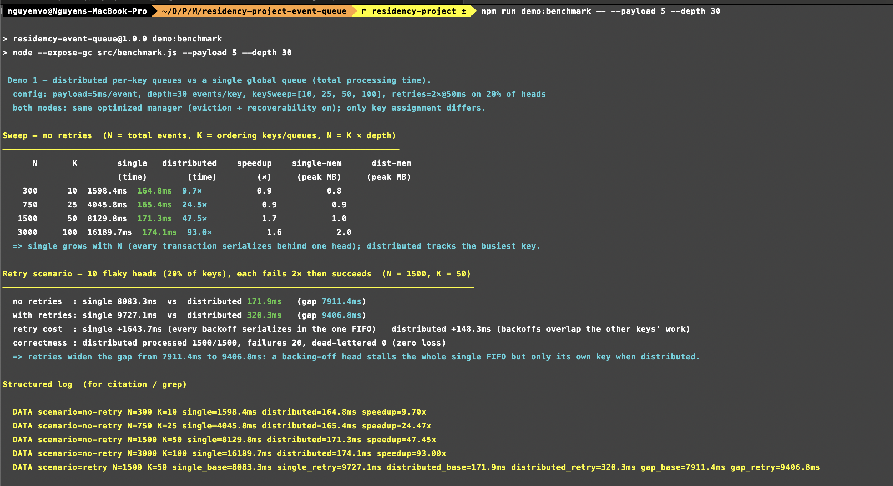
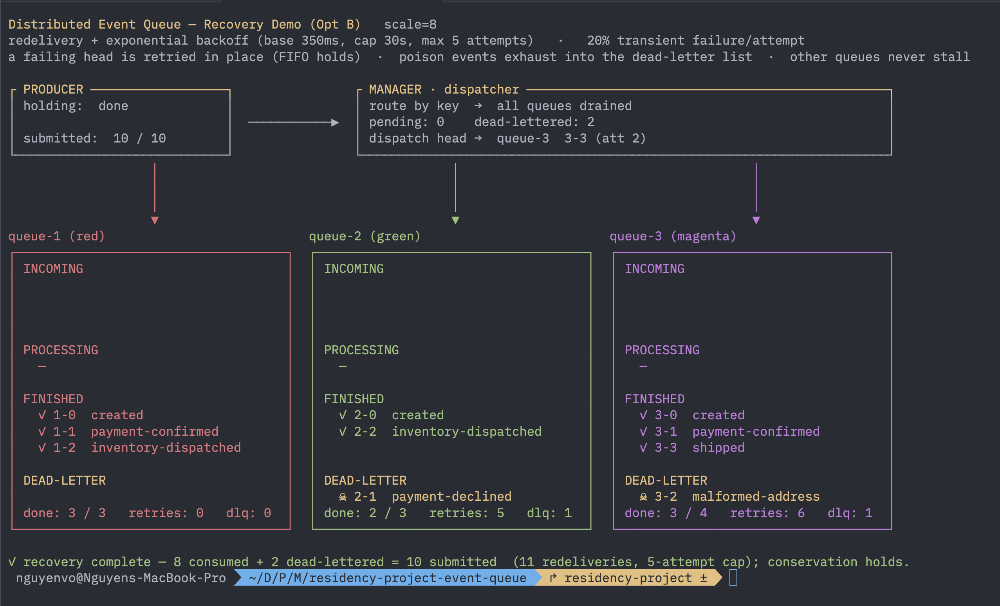
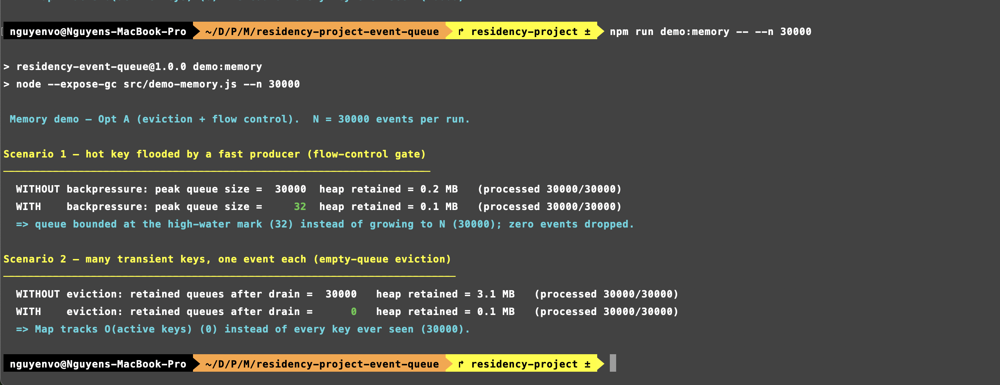

# Optimization and Evaluation of a Distributed Event Queue

*Formatting target: APA 7, 12-point font, double-spaced. Headings follow APA levels.*

## From Proof of Concept to Optimization

The proof of concept established that a hash map from each ordering key to an independent FIFO queue can preserve per key order while allowing unrelated transactions to proceed concurrently, with every operation on the normal path running in constant time. That prototype, however, was deliberately incomplete in two ways. Its memory grew without bound, because a drained queue was never released and a fast producer could flood a single queue. It also stalled easily under failure, because the queue held the failed event in place and never released it, so a failing consumer blocked its queue indefinitely. This work closes these gaps through a disciplined progression. It first optimizes the core data structures, then reasons about how the design scales to large datasets, then validates each change with tests and demonstrations, and finally evaluates the optimized system against the original prototype. Two optimizations anchor the work. The first bounds memory so that the structure tracks only active keys and no queue grows without limit. The second restores recoverability so that a failing event no longer blocks its queue and is instead retried and, when necessary, set aside. Together they turn a correct but fragile prototype into a system whose resource use and fault behavior remain predictable as the workload grows.

## Optimizing the Data Structures

The prototype's most consequential limitation was structural rather than algorithmic. Routing every transaction through a single global queue would serialize independent work behind one head, a condition that worsens whenever a slow or failing event holds the front position. The distributed design already avoids this by giving each ordering key its own queue, echoing the key grouping model in which tuples that share a key are directed to the one instance responsible for that key (Liu et al., 2024). What remained was to keep that structure efficient under load and tolerant of failure, the two properties the following optimizations secure.

### Bounding Memory

The memory optimization works in two parts. First, eviction releases a queue's entry in the Event Queue Manager's map the moment the queue drains, so the map holds a number of entries proportional to the active keys rather than to every key ever observed, which also significantly reduces the performance overhead of the garbage collector. Second, flow control bounds each queue with a high water mark and a low water mark. The two marks form a hysteresis band that prevents the producer from flapping, since a single threshold would resume it only to suspend it again on the very next event. Because the manager extends the Node.js EventEmitter, which offers no native pause and resume, the gate is expressed as a promise that the producer awaits, where a promise is a JavaScript object that stands for asynchronous work that will resolve later. Submission therefore resolves immediately below the high water mark, stays pending once the queue reaches it, and resumes only after consumption drains the queue to the low water mark. This emulates the bounded queue backpressure of stream engines, in which a pipeline that produces data faster than the downstream operators can consume it must slow its source (Hanif et al., 2020). The result addresses both memory failure modes directly, since drained queues no longer accumulate and a hot key can no longer grow without limit, and it does so while never dropping an event.

### Restoring Recoverability

The recoverability optimization closes the second gap the prototype left open. In the proof of concept a consumer error simply left the event unacknowledged at its queue head, which preserved ordering but stalled that key permanently. The optimized manager instead treats a failure as a negative acknowledgment that mirrors the acknowledgment path. When a consumer signals a failure, the manager redelivers the unchanged head after an exponential backoff whose delay doubles with each attempt up to a cap of thirty seconds, retrying to a maximum of five deliveries. This follows the sequential queue discipline of Nowacki et al. (2021), in which the system takes the next message only after the previous one reaches a confirmed state, and it extends that discipline with the retry semantics of a reliable consumer. Because only an acknowledgment can remove the head, the head cannot change while it backs off, so redelivery is safe and strict order holds even under repeated failure. An event that exhausts its five attempts is moved exactly once to a dead letter list kept per key on the manager, after which the queue advances to its next event. This diversion reflects the dead letter queue pattern that Ratra et al. (2025) identify as a best practice for robustness, alongside idempotent consumers that produce identical results whether an event is processed once or several times. Crucially, one key's retries never stall another, because each queue backs off independently while the others continue to dispatch. The optimization therefore converts a permanent stall into a bounded and observable recovery process, and it guarantees that every submitted event ends in exactly one terminal state, either consumed or dead lettered.

## Scaling for Large Datasets

The two optimizations give the structure a predictable footprint as datasets grow, because eviction and the flow control gate together keep memory close to a function of the active keys rather than the total volume of events. Sustaining acceptable performance at a genuinely large scale, however, requires more than a single efficient process, and the natural production path is to treat the distributed event queue as a managed event broker rather than an in memory service with multiple threads. Under this framing each major component of the prototype maps onto an independently scalable service. The manager and its map become the broker itself, a black box that orchestrates ordered delivery; the producer becomes a publisher and the consumer a subscriber; each per key queue becomes an ordered delivery stream selected by an ordering key; acknowledgment becomes the broker's acknowledgment and lease mechanism; the dead letter list becomes a dead letter topic; and the in memory store becomes a durable one. Google Cloud Pub/Sub realizes exactly this contract. Messages published with the same ordering key are expected to be received in order, and unacknowledged messages for one key can delay only that key's delivery, the same head of line property the per key design exhibits (Google Cloud, n.d.-a). Its subscription retry policy adds progressively longer delays between attempts through exponential backoff triggered on a negative acknowledgment or an expired deadline (Google Cloud, n.d.-b), and its dead letter topics forward messages that subscribers cannot acknowledge after a configurable number of attempts, which defaults to five (Google Cloud, n.d.-c). Mapping the components in this way turns each one into a service that scales horizontally without a single point of failure, so the design can survive growth in both event volume and key cardinality.

## Validation, Evaluation, and Performance Analysis

Validation adds assertions targeted at the new behavior, and the full suite of thirty three tests passes. These new checks confirm three behaviors. Flow control suspends the producer at the high water mark and resumes it on drain while dropping nothing, so the submitted and processed counts always agree. An empty queue's map entry is removed on drain. Redelivery, backoff, and dead lettering are exact, meaning an exhausted event reaches the dead letter list exactly once and no other queue stalls while one key retries. Three demonstrations then make the behavior visible, and each result feeds the evaluation that weighs the optimized system against the original prototype on three dimentions: time, robustness, and memory. Because throughput here is bound by the consumer payload, the fair structural metric is the total time to clear identical work, so the demonstrations hold payloads constant and vary only the design under test. Together the automated suite and the demonstrations establish the two properties that key grouping and backpressure control are meant to protect, namely correctness under stress and scalability across growing inputs (Liu et al., 2024; Hanif et al., 2020).

*Figure 2. Total processing time for the single global queue versus the distributed per key design across a sweep of dataset sizes, with a retry scenario showing the gap widening under failure.*

On time, the first demonstration is decisive. Processing the same events, the single global queue clears them in roughly 1600 milliseconds at three hundred events and about 16200 milliseconds at three thousand, whereas the distributed design finishes in roughly 165 and 174 milliseconds respectively, a speedup that widens from about ten times to more than ninety times as the dataset grows (Figure 2). The gap widens further under failure. With failures injected on 20% of the ordering keys, the single queue approach pays every backoff in sequence and slows by more than 1600 milliseconds, while the distributed design overlaps those backoffs with other keys' work and slows by only about one hundred fifty milliseconds, all with zero loss. This advantage is concurrency rather than parallelism, and the distinction bounds it honestly. Node.js runs a single event loop, so the speedup comes from consumers yielding at their awaited work and letting the loop service other keys, not from executing several keys on separate cores. The ceiling is therefore the single core, and once per key work becomes computation bound rather than latency bound, the overlap that produces these numbers would shrink. Crossing that ceiling is precisely what the managed broker path provides, since distributing keys across independent subscriber services replaces cooperative concurrency with true parallelism. The measured result confirms the core design claim, that partitioning independent transactions by key removes the head of line serialization a single queue imposes, and that the benefit compounds as both volume and contention rise.

*Figure 3. Redelivery, exponential backoff, and dead lettering under injected failures, with the per key dead letter section surfaced in the dashboard and a closing conservation check.*

On robustness, the recovery demonstration exercises the retry path under both random and guaranteed failures. It shows ten submitted events resolving into eight consumed and two dead lettered across eleven redeliveries under the five attempt cap, and the closing accounting proves that consumed plus dead lettered equals submitted, so no event is lost even when a consumer fails repeatedly (Figure 3). The dead letter section surfaced per key in the dashboard confirms that an exhausted event is diverted rather than retried forever, which lets its queue advance while the failure is preserved for later inspection. This behavior follows the reliability patterns the literature recommends, since the sequential queue advances only on a confirmed state (Nowacki et al., 2021) and the dead letter queue isolates undeliverable events so the pipeline keeps moving (Ratra et al., 2025). Critically, one key's retries and backoff never stall another, so the robustness guarantee does not come at the cost of the cross key concurrency established above.

*Figure 4. Peak queue size under a flooded hot key and retained queue count under many transient keys, each shown with and without the flow control gate and empty queue eviction.*

On memory, the third demonstration confirms the memory optimization at scale. When a fast producer floods one queue, the unbounded queue grows to the full thirty thousand events, whereas the flow controlled queue never exceeds its high water mark of thirty two. Separately, when thirty thousand transient queues each carry a single event, eviction leaves zero retained queues rather than the thirty thousand retained without eviction, which cuts retained heap from about 3.1 megabytes to roughly 0.1 and keeps the map tracking only active keys (Figure 4). These gains carry deliberate trade offs. Flow control trades a small amount of producer throughput for bounded memory, and recoverability trades added complexity in redelivery, backoff, and dead letter bookkeeping for the guarantee that a failure neither stalls a queue nor loses an event. Taken together, the optimized system delivers four guarantees at once: strict per key ordering, cross key concurrency, bounded memory, and predictable fault behavior. The optimizations do not eliminate the design's core limitations. The system remains a single in memory process that offers no durability across a restart and no parallelism beyond one core, and its throughput stays bound by consumer speed. Future work addresses these limits by promoting the design onto a managed event broker, so that ordering keys, retry backoff, and dead letter topics become durable and horizontally scalable services rather than in memory constructs (Google Cloud, n.d.-a, n.d.-b, n.d.-c). Overall, the optimized system preserves every guarantee of the proof of concept while making its resource use and failure behavior predictable under growth.

## References

Google Cloud. (n.d.-a). *Order messages*. Google Cloud documentation. Retrieved July 18, 2026, from https://cloud.google.com/pubsub/docs/ordering

Google Cloud. (n.d.-b). *Subscription retry policy*. Google Cloud documentation. Retrieved July 18, 2026, from https://cloud.google.com/pubsub/docs/subscription-retry-policy

Google Cloud. (n.d.-c). *Dead-letter topics*. Google Cloud documentation. Retrieved July 18, 2026, from https://cloud.google.com/pubsub/docs/dead-letter-topics

Hanif, M., Yoon, H., & Lee, C. (2020). A backpressure mitigation scheme in distributed stream processing engines. In *ICOIN 2020* (pp. 713–716). IEEE. https://doi.org/10.1109/ICOIN48656.2020.9016513

Liu, G., Wang, Z., Zhou, A. C., & Mao, R. (2024). Adaptive key partitioning in distributed stream processing. *CCF Transactions on High Performance Computing, 6*(2), 164–178. https://doi.org/10.1007/s42514-023-00179-3

Nowacki, P., Roszczyk, R., & Krupa, A. (2021). Distributed event queue management system. In *2021 22nd International Conference on Computational Problems of Electrical Engineering (CPEE)* (pp. 1–4). IEEE. https://doi.org/10.1109/CPEE54040.2021.9585262

Ratra, K. K., Seth, D. K., Verma, D., & Burman, H. (2025). Designing high-throughput event-driven architectures for e-commerce fulfillment at global scale. In *2025 IEEE 16th Annual Information Technology, Electronics and Mobile Communication Conference (IEMCON)* (pp. 481–490). IEEE. https://doi.org/10.1109/IEMCON67450.2025.11381226
